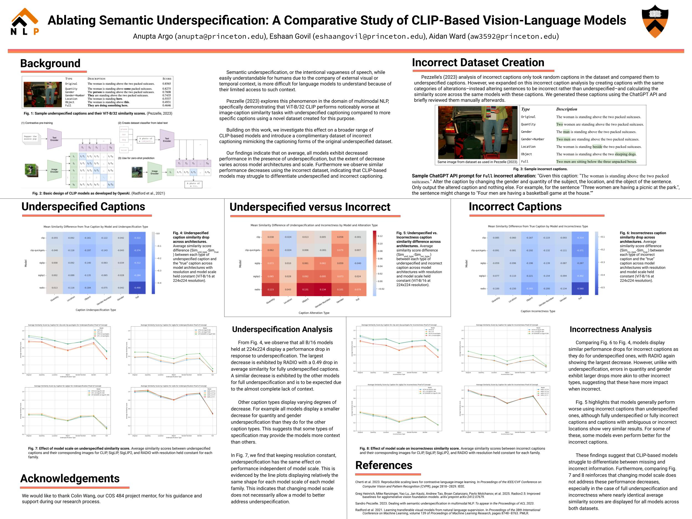
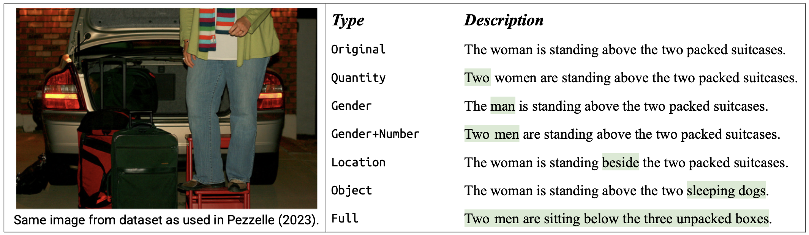

# Ablating Semantic Underspecification: A Comparative Study of CLIP-Based Vision-Language Models

  

  <a href="https://arxiv.org/abs/2306.05240">Pezzelle 2023</a>

This repository contains the code, datasets, results, and steps for reproducing our ablation study that builds upon the paper [Dealing with Semantic Underspecification in Multimodal NLP](https://arxiv.org/abs/2306.05240) by [Sandro Pezzelle](https://sandropezzelle.github.io).

Pezzelle (2023) showed that semantic underspecification, intentional vagueness in image captioning, leads to decreased performance in one version of CLIP (ViT-B/32). Our work expands on this by evaluating a broader range of CLIP-based architectures and their scales, but also by introducing a novel referentially incorrect captioning dataset that mimics the alteration structures of Pezzelle's original underspecified dataset in order to compare underspecified and incorrect captioning.

  

Poster Summary

# Dataset Generation

### Dataset Design

We introduce a complementary dataset of referentially incorrect captions, mirroring Pezzelle’s underspecification dataset. We created these by (1) identifying the same parts of speech modified in the underspecified dataset and (2) modifying those parts to make them incorrect. Generation was handled using ChatGPT API and manually curated by humans.

### Sample Prompt for Full Alteration

  

 Example of Refentially Incorrect Caption

Sample ChatGPT API prompt for Full incorrect alteration: `Given this caption: “The woman is standing above the two packed suitcases.”
Alter the caption by changing the gender and quantity of the subject, the location, and the object.
Only output the altered caption and nothing else.`

For example, “Three women are having a picnic at the park.” might become “Four men are having a basketball game at the house.”

# Experimental Overview

We conduct **two ablations** to explore how architecture and model scale influence performance in the presence of underspecified and incorrect captions.

### Ablation (1) - Breadth (Cross-Model Comparison)

We hold resolution -- with the exception of RADIO -- and model scale constant while varying model family (e.g. CLIP vs SigLIP). The models used for breadth are:

- **CLIP @ 224x224**
  - ViT-B-16
- **CLIP with quickGELU @ 224x224**
  - ViT-B-16-quickgelu (224x224)
- **SigLIP @ 384x384**
  - ViT-B-16-SigLIP-384
- **SigLIP2 @ 384x384**
  - ViT-B-16-SigLIP2-384
- **RADIO**
  - radio_v2.5-b (B/16)

### Ablation (2) – Depth (Intra-Family Scale Comparison)

For depth, we keep the resolution -- with the exception of RADIO -- and model family constant while varying model scale (e.g. B/16 vs H/14). The models used for depth are:

- **CLIP**
  - ViT-B-16 (224x224)
  - ViT-L-14 (224x224)
- **CLIP with quickGELU activation**
  - ViT-B-16-quickgelu (224x224)
  - ViT-L-14-quickgelu (224x224)
- **SigLIP**
  - ViT-B-16-SigLIP-384 (384x384)
  - ViT-L-16-SigLIP-384 (384x384)
  - ViT-SO400M-14-SigLIP-384 (384x384)
- **SigLIP2**
  - ViT-B-16-SigLIP2-384 (384x384)
  - ViT-L-16-SigLIP2-384 (384x384)
  - ViT-SO400M-16-SigLIP2-384 (384x384)
- **RADIO**
  - radio_v2.5-b (B/16)
  - radio_v2.5-l (L/16)
  - radio_v2.5-h (H/16)
  - radio_v2.5-g (H/14)

# Summarized Results

### Underspecification

- All B/16 models at 224x224 resolution show similarity score drops for underspecified captions.
- RADIO shows the largest drop (−0.49) for fully underspecified captions.
- Quantity and gender underspecification result in smaller performance drops than other types of underspecification.

### Incorrectness

- Incorrect captions cause performance drops similar to or greater than underspecified captions.
- Gender and quantity errors are more impactful when incorrect rather than underspecified, as displayed by performance drops similar to other types of incorrectness alterations.

### Underspecification versus Incorrectness

- Models often fail to differentiate between missing and incorrect information.
- In some cases, performance is worse for underspecified captions than incorrect ones (e.g., location-based).

### Model Family and Scaling

- Scaling up model size does **not** resolve performance losses from underspecification or incorrectness.
- Similar average similarity trends across scales suggest architecture plays a larger role.
- However, regardless of architecture, all models exhibit drops in performance.

# Steps for Recreation

1. Create a Python venv using Python version 3.10 (necessary for RADIO as of when this repository was created), i.e. run
   `python3.10 -m venv /path/to/your/env` .

2. Activate your venv and run `pip install -r requirements.txt` from the root directory.

3. Also install OpenAI CLIP from the repository by running `pip install git+https://github.com/openai/CLIP.git` .

4. Run `/Applications/Python\ 3.10/Install\ Certificates.command` for `torch.hub` .

5. Run `python main_PoC1.py` and `python main_PoC2.py` in `/sunglass` to run Pezzelle's experiements.

6. To generate a new incorrect captions dataset with the name `init_inc_100_samples.csv`, create an environment variable with the name `OPENAI_API_KEY` containing the OpenAI API key, then run `python inc_creator.py` in the top directory. Next, review the results as needed, rename the file to `inc_100_samples.csv`, and move the file to `/ablations`.

7. To run all of the experiments again at once, in `/ablations` run `make clean` followed by `make all` . (The executions and deletions for RADIO are commented out. This is on purpose because it forces you to confirm that you want to delete the results files, since the generation of the RADIO model results takes significantly longer than the other model families.)

8. To run each part of the experiment separately:

   a. Run `python run_models.py <caption_type> <model_name>` in `/ablations` to generate the results for that caption type and model family.

   b. Run `python generate_violin_plots.py <caption_type> <model_name>` in `/ablations` to generate the violin plots of the results for that caption type and model family.

   c. Run `python analyze_breadth.py <caption_type> <plot_type>` in `/ablations` to generate the heatmap or line plot for the breadth analysis for that caption type.

   d. Run `python analyze_depth.py <caption_type> <model_name>` in `/ablations` to generate the line plot for the depth analysis for that caption type and model family.

# Note on Running RADIO

2.5-g uses H/14, which has the most parameters, so it will take a while to complete (~45 min/run on sunglass dataset)
