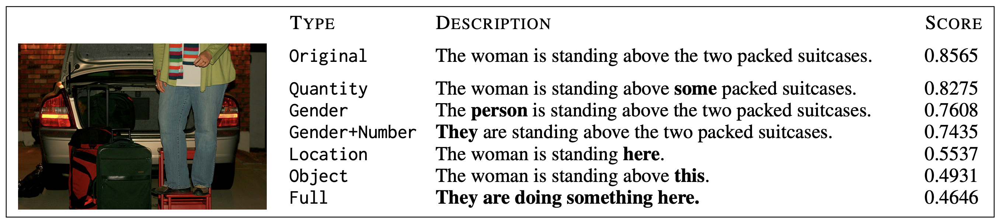

# “Ablating Semantic Underspecification: A Comparative Study of CLIP-Based Vision-Language Models

    

<a href="https://arxiv.org/abs/2306.05240">Pezzelle 2023</a>

In this repository we present the code, results, and steps for reproduction of an ablation study of the paper [Dealing with Semantic Underspecification in Multimodal NLP](https://arxiv.org/abs/2306.05240) by [Sandro Pezzelle](https://sandropezzelle.github.io). Building on this work, which explored how underspecification in image captions affects CLIP model performance, this project extends the original analysis through two complementary ablations. First, we vary CLIP model types while holding architecture constant and compare performance. Second, we vary architectural and resolution parameters such as patch size and activation function while holding model variant family constant in order to assess performance differences within the same family.

# Ablation (1) - Breadth

For breadth, we keep the architecture constant and vary the models. For the architecture, we choose B-16 with all having 224x224 resolution.

The exact models to be used for breadth comparison are:
- ViT-B-16, (openai)
- ViT-B-16-quickgelu, (openai)
- ViT-B-16-SigLIP, (webli)
- ViT-B-16-SigLIP2, (webli)
- radio_v2.5-b, (N/A)

# Ablation (2) - Depth

For depth, we keep the model constant and vary model parameters such as patch size (e.g., B/16 vs H/14).

The exact models to be used for depth comparison are:
- **CLIP**
  - ViT-B-16 (224x224)  
  - ViT-L-14 (224x224)  
- **CLIP with quickGELU activation**
  - ViT-B-16-quickgelu (224x224)  
  - ViT-L-14-quickgelu (224x224)  
- **SigLIP**
  - ViT-B-16-SigLIP-384 (384x384)  
  - ViT-L-16-SigLIP-384 (384x384)  
  - ViT-SO400M-14-SigLIP-384 (384x384)  
- **SigLIP2**
  - ViT-B-16-SigLIP2-384 (384x384)  
  - ViT-L-16-SigLIP2-384 (384x384)  
  - ViT-SO400M-16-SigLIP2-384 (384x384)  
- **RADIO**
  - radio_v2.5-b
  - radio_v2.5-l
  - radio_v2.5-h
  - radio_v2.5-g

# Steps for Recreation

1. Create a python venv using python version 3.10 (necessary for RADIO) i.e. run
`python3.10 -m venv /path/to/your/env`

2. Activate your venv and run `pip install -r requirements.txt` from the root directory

3. Also install OpenAI CLIP from the repository by running `pip install git+https://github.com/openai/CLIP.git`

4. Run `/Applications/Python\ 3.10/Install\ Certificates.command` for `torch.hub`

5. Run `main_PoC1.py` and `main_PoC2.py` in `/paper` to run paper's experiement

6. Run `python run_models.py <model_name>` in `/ablations` to run Proof of Concept 1 from the paper for both the depth and breadth comparisons

7. For faster execution, in `/ablations` run `make clean` followed by `make all` to re-run all models. The clean for RADIO is commented out. This is on purpose because it forces you to confirm that you want to delete the file

# Note on running RADIO
2.5-g uses H/14, which has the most parameters, so it will take a while to complete (~45 min/run on paper dataset)